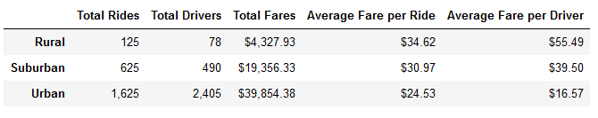
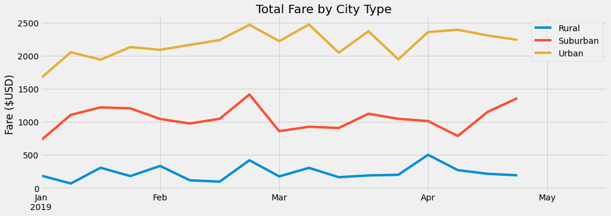

# Module 05 Challenge - PyBer Analysis

## Overview of the Analysis

The purpose of this analysis was to provide a historical overview for a collection
of PyBer rideshare data for the four-month period between January, 2019 and April, 2019.

Interesting trends should be noted, any disparities commented upon, and recommendations provided for moving forward.

### Resources

- Data Source(s): `city_data.csv`, `ride_data.csv` (Provided by Management)
- Software: Jupyter notebook server 6.3.0, running Python 3.7.10 64-bit (Dependencies:  matplotlib, numpy, os, pandas)

`city_data.csv` contains a list of 120 Cities currently served by PyBer at the time of this report. Each city has its current Driver Count listed, as well as a classification of city type: *Urban, Suburban,* or *Rural.*

Distributed among the 120 cities, there are a total of 2,973 drivers, allocated as follows:

|City Type|Number of Cities|Total Number of Drivers|Average Number of Drivers|
|---------|----------------|-----------------------|-------------------------|
|Urban    |66              |2,405                  |36                       |
|Suburban |36              |490                    |13                       |
|Rural    |18              |78                     |4                        |

The largest number of drivers in one city is 73 in West Samuelburgh, which is Urban. The smallest number of drivers in one city is 1, which is the number of drivers in 7 different Rural cities.

`ride_data.csv` contains records for a total of 2,375 rides during the time of study. Each ride has a unique `ride_id` and a Total Fare ($USD).

|City Type|Number of Rides |
|---------|----------------|
|Urban    |1,625           |
|Suburban |625             |
|Rural    |125             |

## Results

### Data Quality
Neither input file contains any NULL values. All records correspond to the correct field, using the correct units, and corresponding to the expected data type.

### Results

Within a Python Jupyter Notebook, the two input files were combined using their common `city` field. This combined dataset was used for the remainder of the analysis.

Figure 1 shows a summary of the rides data, including the Total Fares, Average Fare per Ride, and Average Fare per Driver, broken down according to City Type.

Figure 1: 

Once this summary information was obtained, the analysis proceeded to generate a graphical representation of the Total Fare, by City Type, by Week during the time under consideration. This is shown below in Figure 2.

Figure 2:

## Summary
