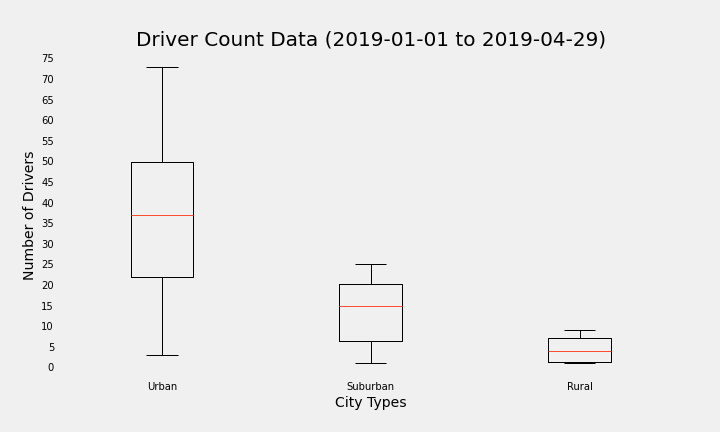
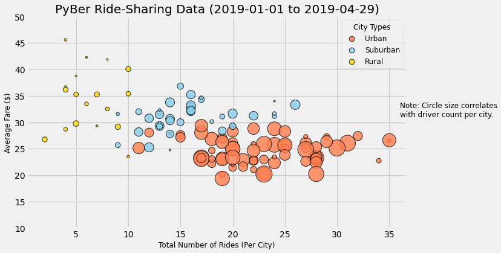

# Module 05 Challenge - PyBer Analysis

## Overview of the Analysis

The purpose of this analysis was to provide a historical overview for a collection
of PyBer rideshare data for the four-month period between January, 2019 and April, 2019.

Interesting trends should be noted, any disparities commented upon, and recommendations provided for moving forward.

### Resources

- Data Source(s): `city_data.csv`, `ride_data.csv` (Provided by Management)
- Software: Jupyter notebook server 6.3.0, running Python 3.7.10 64-bit (Dependencies:  matplotlib, numpy, os, pandas)

`city_data.csv` contains a list of 120 Cities currently served by PyBer at the time of this report. Each city has its current Driver Count listed, as well as a classification of city type: *Urban, Suburban,* or *Rural.*

Distributed among the 120 cities, there are a total of 2,973 drivers, allocated as follows:

|City Type|Number of Cities|Total Number of Drivers|Average Number of Drivers|
|---------|----------------|-----------------------|-------------------------|
|Urban    |66              |2,405                  |36                       |
|Suburban |36              |490                    |13                       |
|Rural    |18              |78                     |4                        |

The largest number of drivers in one city is 73 in West Samuelburgh, which is Urban. The smallest number of drivers in one city is 1, which is the number of drivers in 7 different Rural cities.

`ride_data.csv` contains records for a total of 2,375 rides during the time of study. Each ride has a unique `ride_id` and a Total Fare ($USD).

|City Type|Number of Rides |
|---------|----------------|
|Urban    |1,625           |
|Suburban |625             |
|Rural    |125             |

### Data Quality
Neither input file contains any NULL values. All records correspond to the correct field, using the correct units, and corresponding to the expected data type. Comma delimiters are consistently used.

## Results

Within a Python Jupyter Notebook, the two input files were combined using their common `city` field. This combined dataset was used for the remainder of the analysis.

Figure 1 below shows a summary of the combined cities and rides data. The Urban Cities represent the bulk of the Rides and Fares (13x the Rural Rides, and 9x the Rural Fares). There are a Total of 30x more drivers in all of the Urban Cities than there are in all of the Rural Cities. Conversely, the Average Fare per Ride and the Average Fare per Driver are more in the Rural Cities. In each of these cases, the results in the Suburban Cities are somewhere in the middle.

Figure 1: 

Figure 2 below shows how the Number of Drivers per City differs greatly between the different city types. The Urban Cities have a wide distribution, with Driver Counts between 3 and 73 (Mean of 36), while the Rural Cities only have between 1 and 9 Drivers per City (Mean of 4).

Once this summary information was obtained, the analysis proceeded to generate a graphical representation of the Total Fare, by City Type, by Week during the time under consideration. This is shown in Figure 3 below.

Looking at Figure 3, you can see that broadly over time the Total Fares per Week for each city type remain relatively constant, but there is some seasonal variabion that can be commented on, as well as the relative level of Total Fares.

The Urban Cities consistently have higher Total Fares, owing to the fact that they have a much larger number of rides overall. The Urban Cities have lower Total Fares in the winter months of January and Febuary, while they increase moving into March, April, and May. The Suburban Cities look to be having an increase in Total Fares from April moving in to May, but these results must be monitired to see if this trend continues. All three city types experienced an increase in Total Fares in late February, and the Rural Cities show an increase in Total Fares at the beginning of April. Further investigation is needed to explain these trends.

Figure 3:

Another way to look at the information provided is to look at the Average Fare per City versus the Total Number of Rides per City. The Number of Drivers per City can also be incorporated into this visualization to help tell a more complete story. This is shown below in Figure 4.

Figure 4:

## Summary

Additional information, such as distance per Ride and Population for each City could allow for more in-depth analysis, but as it stands now there are still some general conclusions that can be reached by looking at this dataset.

- The Average Fares are generally higher in the Rural Cities, owing to the fact that there are definitely fewer drivers present in those areas, and we can infer that there are also fewer passengers desiring transportation there as well. When a Ride is desired, it is more likely to be of a greater distance, using a scarcer resource of drivers in the area.
- Conversely, Average Fares are lower in the Urban Cities, presumably due to the shorter distance of each Ride, combined with the higher number of drivers present in those areas. However, this shortcoming is compensated for by the much greater number of Rides overall, yielding higher Total Fares.
- Most seasonal variation affects all three City Types roughly equally, but moving in to summer there appears to be some external force driving an increase in total fares in the Suburban Cities much more than the Rural or Urban Cities.

### Business Recommendations:

1. Continue to devote the bulk of expansion efforts in Urban-classified Cities. It is tempting due to the higher Average Fares per Ride to commit resources to the Rural Cities, but owing to their lower populations and lower overall demand for Rides, the point of diminishing returns would be realized much sooner than for their Urban counterparts.
2. Further investigate the spike in activity in February. Does this pattern hold every year, or was there some occurrence in 2019 that caused it to happen only once. If it is a yearly occurrence, this demand could be anticipated and taken advantage of by fielding a larger number of drivers in each market for greater overall profitibility.
3. If the upward trend of Total Fares in Suburban Cities continues, consider committing more drivers and resources to these areas. Is this trend a result of a Population Shift, or some other external factor?
